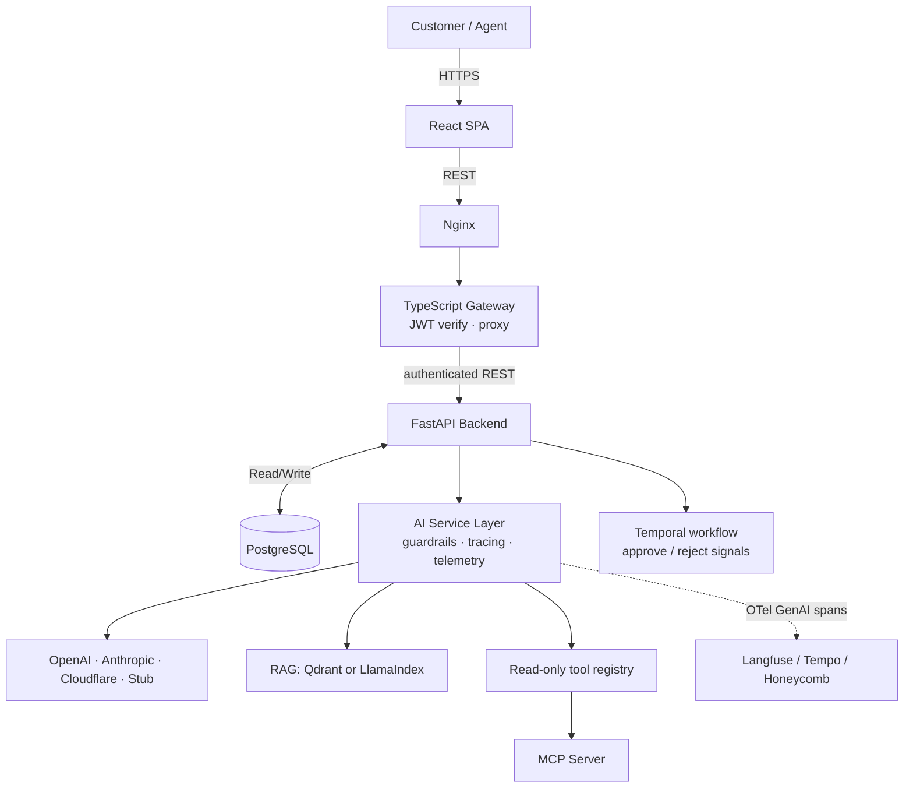

# SupportDesk — AI-Native Support Operations Platform


A support ticket system built around one principle: **AI suggests, agents
decide.** The AI layer triages tickets, retrieves policy evidence, calls
read-only tools, and drafts replies — and never sends anything, changes ticket
state, or promises a refund on its own authority.

What makes this more than a chatbot with a ticket table is the engineering
*around* the model: guardrails that fail closed, per-call cost and latency
tracing, an evaluation harness wired into CI as a regression gate, and a
workflow layer with a human-approval gate — run today by an explicitly
non-durable in-process runner, with the Temporal path shipped but not yet
verified on a live cluster.

> Applying for an AI engineering role? [`docs/JD-MAP.md`](docs/JD-MAP.md) maps
> each job requirement to the code that satisfies it — including the parts that
> are **not** implemented.

## 🚦 Production status (re-audited 2026-10-07, post-CD)

| Component | URL | State |
|---|---|---|
| Frontend (Cloudflare Pages, canonical) | https://supportdesk-cta.pages.dev | Serving (200); deployed bundle calls `supportdesk-api-kh02.onrender.com`; CORS preflight from this origin → 200 |
| Frontend (legacy, stale) | https://supportdesk-aht.pages.dev | Served from an older Cloudflare account; excluded from CORS and no longer deployed by this repo. Do not demo this URL |
| API (Render, canonical) | https://supportdesk-api-kh02.onrender.com | `GET /api/health` → 200, `/openapi.json` → 200, unauthenticated `/api/tickets` → 401; CORS preflight from the Pages origin → 200 |
| Older Render instance | `supportdesk-api-zpkv.onrender.com` | **Suspended** — never referenced by workflows, docs or the Pages build |

Owner action still required: sync the updated blueprint to the canonical
`supportdesk-api-kh02` Render service and rerun `scripts/smoke-production.sh`
to verify that CORS now allows only `https://supportdesk-cta.pages.dev`. The
legacy `aht` origin is intentionally excluded from the repository blueprint.
- Verified CV claims live in [`docs/CV_EVIDENCE.md`](docs/CV_EVIDENCE.md): the
  eval dataset is **92 records** (not "100+"); no "30% misclassification
  reduction" claim is made.

---

## The four problems this actually solves

**1. An LLM feature you cannot measure is a liability.**
`evaluation/eval_suite.py` measures four things on a labeled dataset:
classification quality, schema validity, how often the guardrails block output,
and the cost and latency per ticket. `--check` compares a run against
`evaluation/baseline.json`, and CI fails the build on a >2pp accuracy drop, a
guardrail-rate spike, or a p95 latency blow-up.

**2. Cost and latency are invisible until the bill arrives.**
Every provider call is persisted to `ai_call_traces` with token counts, a USD
cost computed from a versioned rate table, latency, and outcome.
`GET /api/metrics/ai` returns per-model p50/p95, error rate, and cost per
successful call. A model with no published price reports `null`, not a
fabricated zero.

**3. Model output is untrusted.**
Output passes deterministic guardrails before an agent sees it: no refund
commitments, no claims of facts absent from the thread, no prompt-injection
echo, and no internal detail — a tool error echoed into a draft is rejected
rather than sent to a customer. A violation returns `502` and leaves the ticket
untouched.

**4. Long-running AI work loses state.**
The ticket pipeline is defined as a Temporal workflow: classify → retrieve →
draft → **suspend for human approval** → send. The gate is modeled as a real
`wait_condition` resumed by a signal, so the design is durability-first rather
than "hold a worker and hope".

To be precise about its current state: what runs today is the in-process
runner, which is explicitly not durable. The Temporal worker and workflow
definitions are present in the repo, but they have not been verified against a
live Temporal cluster — the default configuration runs with
`TEMPORAL_ENABLED=False`. `docs/interview-qa.md` has the evidence.

---

## Architecture



The gateway is the caller-facing security boundary: it verifies the JWT before
any request — including an AI call — reaches the Python service. Only
`POST /api/tickets`, `/api/auth/login` and `/api/auth/register` are public.

---

## Features

**Ticket lifecycle**
- Backend-enforced state machine (`OPEN → IN_PROGRESS → WAITING → RESOLVED → CLOSED`); illegal transitions return `409`.
- Optimistic concurrency via a conditional `UPDATE ... WHERE status = <expected>`, so two agents editing one ticket cannot silently overwrite each other.
- Guest submissions via `POST /api/tickets`, rate limited per client IP. The bucket keys on the peer address, not a spoofable `X-Forwarded-For`.

**AI layer**
- **Classification** with category, priority, summary and confidence. Malformed provider output never corrupts ticket data.
- **Agent tool loop** (`POST /api/tickets/{id}/ai/agent`): the model requests read-only tools (`get_ticket_history`, `search_similar_tickets`, `search_knowledge_base`, `lookup_order`), receives results, and drafts. Bounded by `TOOL_MAX_STEPS`, with repeated-call detection to stop runaway loops.
- **Tool arguments validated by the same Pydantic model that generates the advertised JSON schema**, with `extra="forbid"` so a hallucinated parameter fails loudly instead of being ignored.
- **MCP server** (`python -m app.mcp_server`) publishing those tools over the Model Context Protocol, so another agent can reuse this deployment's knowledge base without importing this codebase.
- **LangGraph workflow** (`POST /api/tickets/{id}/ai/workflow`) — a real `StateGraph` with `MemorySaver` checkpointing and `interrupt()`/`Command(resume=...)` for the approval gate.
- **RAG** over the knowledge base using Qdrant (embedded or server) with an in-process LlamaIndex fallback that degrades rather than fails when a store is unreachable.
- **Similar-ticket retrieval** over per-ticket embeddings. Each vector records the embedder and width that produced it, so vectors from different embedders are never compared.

**Event-Driven Architecture & SLA Engine**
- **Transactional Outbox Pattern**: Ticket lifecycle mutations (`TicketCreated`, `TicketAssigned`, `TicketStatusChanged`, `TicketResolved`) write atomic domain events into `outbox_events` within the same DB transaction, preventing split-brain states.
- **Outbox Publisher Worker**: Poller batch-reads pending events and dispatches them to Apache Kafka (`app.workers.outbox_publisher`).
- **Kafka Topics with Offline Resilient Fallback**: Event topics (`ticket-events`, `ticket-events-retry`, `ticket-events-dlq`) with automatic in-memory buffering when Kafka is offline, ensuring deterministic test execution.
- **Consumer Idempotency & DLQ**: Background consumers (`app.workers.notification_worker`) check `processed_events` before execution, ensuring exactly-once delivery; failed events route to `ticket-events-retry` and terminate at `ticket-events-dlq` after 3 failed attempts.
- **Priority-based SLA Engine**: Target calculation (Urgent 1h/4h, High 4h/8h, Normal 8h/24h, Low 24h/48h), proactive 80% warning alerts, breach auto-escalation, and live database metrics exposed at `GET /api/sla/metrics`.

> Honesty note: the outbox, consumer-idempotency and SLA code above really
> exists and is covered by unit tests, but tests run against an in-memory
> Kafka fallback, and this stack has not been verified in a production
> deployment.

**Providers**: Anthropic (Claude), OpenAI-compatible, Cloudflare Workers AI, and a deterministic offline stub. The entire test suite runs with no API key.


---

## Tech Stack

**Backend (Python)** — FastAPI, SQLAlchemy 2, Alembic (6 migrations), Pydantic; LangGraph (checkpointed state graph), Temporal (workflow definitions; worker not yet verified on a live cluster, `TEMPORAL_ENABLED=False` by default); LlamaIndex + Qdrant (RAG), sentence-transformers/MiniLM, scikit-learn; OpenTelemetry SDK; MCP SDK.

**Gateway (TypeScript)** — Fastify 5, `jose` for JWT verification, Zod for config validation; `tsc` under `strict` + `noUncheckedIndexedAccess` + `exactOptionalPropertyTypes`.

**Frontend** — React 18, TypeScript, Vite, React Router, Vitest.

**Infrastructure** — Docker + Compose (Postgres, backend, gateway, frontend, Qdrant, Temporal); GitHub Actions (backend suite, eval gate, gateway typecheck/build/test, frontend build/test); deploy to Render + Cloudflare Pages.

---

## Quick start

```bash
# Everything in containers
export JWT_SECRET="$(python3 -c 'import secrets; print(secrets.token_hex(32))')"
docker compose up -d --build

# Or run the backend directly
cd backend
uv venv --python 3.11 .venv && VIRTUAL_ENV=.venv uv pip install -r requirements.txt
export JWT_SECRET="$(python3 -c 'import secrets; print(secrets.token_hex(32))')"
AI_PROVIDER=stub .venv/bin/python -m pytest -q      # no API key needed
.venv/bin/uvicorn app.main:app --reload
```

## Verifying it works

```bash
cd backend  && .venv/bin/python -m pytest -q              # backend suite
cd gateway && npm ci && npm run typecheck && npm test     # TypeScript
cd frontend && npm ci && npm test                        # React
AI_PROVIDER=stub python evaluation/eval_suite.py --check  # eval regression gate
```

See [`docs/JD-MAP.md`](docs/JD-MAP.md) for measured numbers, the evidence behind
each claim, and an explicit list of what is **not** implemented.

---

## 📡 API Reference

The gateway proxies `/api/*` to the backend after verifying the JWT. Public
endpoints are `POST /api/tickets`, `/api/auth/login`, `/api/auth/register`, and
the gateway's own `/healthz` and `/readyz`.

| Method | Endpoint | Description |
| :--- | :--- | :--- |
| `POST` | `/api/auth/login` | Authenticate user & get JWT |
| `POST` | `/api/auth/register` | Register a customer account (role is always `customer`) |
| `POST` | `/api/tickets` | Create a support ticket (guest submissions allowed, per-IP rate limited) |
| `GET` | `/api/tickets` | List tickets (filters & pagination) |
| `GET` | `/api/tickets/{id}` | Ticket detail |
| `PATCH` | `/api/tickets/{id}` | Update status/priority (Agent only, state machine enforced) |
| `POST` | `/api/tickets/{id}/messages` | Add a message |
| **AI** | | |
| `POST` | `/api/tickets/{id}/ai/analyze` | Classify the ticket; persists triage + logs a prediction |
| `POST` | `/api/tickets/{id}/ai/suggest` | Draft a reply (never sends it) |
| `POST` | `/api/tickets/{id}/ai/agent` | Run the tool-calling agent loop; returns the draft and the tool calls |
| `POST` | `/api/tickets/{id}/ai/workflow` | LangGraph pipeline with checkpointed approval gate |
| `POST` | `/api/tickets/{id}/ai/workflow/run` | Start a workflow run (in-process runner; not durable) |
| `GET` | `/api/tickets/{id}/ai/workflow/{wid}` | Workflow run state, including whether it awaits approval |
| `POST` | `/api/tickets/{id}/ai/workflow/{wid}/decision` | Approve or reject a suspended run |
| `GET` | `/api/tickets/{id}/similar` | Similar resolved tickets with similarity scores |
| `GET` | `/api/tickets/ai/knowledge/stats` | Knowledge-base stats incl. active vector store |
| **Ops** | | |
| `GET` | `/api/metrics` | In-process counters: calls, errors, p50/p95, tokens, USD (Agent only) |
| `GET` | `/api/metrics/ai` | Durable per-model cost/latency/error breakdown (Agent only) |
| `GET` | `/api/metrics/ai/recent` | Most recent LLM calls, newest first (Agent only) |
| `GET` | `/api/dashboard/stats` | Agent dashboard statistics (Agent only) |
| `GET` | `/api/health` | System health check |

---

## 🔒 Security Model

- **Gateway-first authentication.** The TypeScript gateway verifies the HS256 JWT (`jose`) before any `/api` request reaches the Python service, so an unauthenticated call never consumes an upstream round trip. The backend still re-authorizes: a gateway check is a convenience, not the boundary. Only `POST /api/tickets`, `/api/auth/login` and `/api/auth/register` are public.
- **No role escalation.** `POST /api/auth/register` hard-codes the `customer` role, so a client cannot self-assign `agent` — `tests/test_auth_register.py::test_register_cannot_escalate_to_agent`. First-agent provisioning uses a one-time token compared with `hmac.compare_digest`, and an unset token disables the route entirely.
- **Agent-scoped operations.** `/api/metrics*` exposes call counts, token totals, costs and latencies; it is agent-only, so an unauthenticated capability is not hiding in the schema.
- **Guest submissions are deliberate, and rate limited.** `POST /api/tickets` must work before signup. The control that bounds it is a per-client-IP limit (`TICKET_CREATE_RATE_LIMIT`, default `10` per `TICKET_CREATE_RATE_WINDOW_S` seconds) returning `429` with `Retry-After`. Authenticated submitters are not charged against it. The bucket keys on the peer address, not `X-Forwarded-For`, which a client could spoof; behind a TLS-terminating proxy, run uvicorn with `--proxy-headers --forwarded-allow-ips=<proxy>`.
- **AI output is untrusted.** Deterministic guardrails reject refund/compensation commitments, facts absent from the thread, prompt-injection echo, and internal detail (a tool error echoed into a draft). `AI_GUARDRAIL_MODE=reject` returns `502` and leaves the ticket untouched; `fallback` substitutes a neutral draft. Tool calls are audited, and all tools are read-only.
- **Token storage tradeoff (known limitation).** The SPA keeps the JWT in `localStorage` (`frontend/src/lib/api.ts`) — this is *not* presented as best-practice production auth. An HttpOnly-cookie + CSRF architecture would be strictly better, but migrating would require coordinated backend/gateway/frontend changes with a high regression risk before the current milestone, so it stays as a documented tradeoff: XSS mitigations in place are React's default output escaping (no `dangerouslySetInnerHTML` in app code), short token expiry, and backend re-authorization on every request so a stolen token's blast radius is bounded by role checks. Do not claim "secure cookie auth" for this project.
- **Assignment and audit are durable.** `POST /api/tickets/{id}/assign` persists `assignee_id` (agent-only target, enforced in `ticket_service.assign_ticket`) and writes a `ticket.assign` row to `audit_events`; the automation endpoint executes synchronously (see its docstring) rather than pretending to queue durable jobs.
- **Not implemented, deliberately.** No PII redaction, no multi-tenancy, no fine-grained RBAC beyond customer/agent. `docs/spec.md` records these as out of scope. Separately, two features exist in code but are not verified for production: the SLA/outbox stack (not validated against real Kafka + a live deployment) and the Temporal worker (shipped, not yet verified on a live cluster; the default config runs with `TEMPORAL_ENABLED=False` on the non-durable in-process runner).

---

## 📂 Project Structure

```text
├── backend/
│   ├── app/
│   │   ├── api/           # Route handlers (auth, tickets, ai, metrics, webhooks)
│   │   ├── models/        # SQLAlchemy ORM models (incl. ai_call_traces)
│   │   ├── schemas/       # Pydantic request/response schemas
│   │   ├── services/      # AI layer, LangGraph workflow, tracing, telemetry,
│   │   │                  #   pricing, vector store, knowledge base, guardrails
│   │   ├── tools/         # Read-only agent tools + allowlisted registry
│   │   ├── workflows/     # Temporal definitions + in-process runner
│   │   ├── mcp_server.py  # MCP server over the shared tool registry
│   │   ├── config.py      # Env-driven settings, validated at import
│   │   └── security.py    # JWT + password hashing
│   ├── knowledge/         # Support policy docs for RAG
│   ├── tests/             # 34 test files
│   ├── alembic/           # Migrations (6)
│   └── Dockerfile
├── gateway/               # TypeScript API gateway (Fastify, strict TS)
│   ├── src/               # config, auth, backend client, server, tests
│   └── Dockerfile
├── frontend/              # React SPA + nginx.conf
├── evaluation/
│   ├── tickets.json       # 92 labeled evaluation tickets
│   ├── eval_suite.py      # 4-metric harness + regression gate
│   ├── baseline.json      # Recorded baseline for `--check`
│   └── evaluate.py        # Classification-only evaluation
├── docs/                  # spec, JD map, recruiter evidence, interview Q&A
├── docker-compose.yml     # db, backend, gateway, frontend, qdrant, temporal
├── render.yaml            # Render deployment blueprint
└── .github/workflows/     # CI: backend, eval gate, gateway, frontend
```

---

## 🧪 Testing & Evaluation

```bash
cd backend  && .venv/bin/python -m pytest -q            # 368 tests + 1 skip, offline
cd gateway && npm ci && npm run typecheck && npm test   # 56 tests, strict TS
cd frontend && npm ci && npm test                      # 15 tests
```

### AI evaluation pipeline

```bash
# Classification accuracy / macro-F1 / per-category F1
AI_PROVIDER=stub python evaluation/evaluate.py

# Full harness: classification + schema validity + guardrails + cost/latency
AI_PROVIDER=stub python evaluation/eval_suite.py

# Regression gate used by CI
AI_PROVIDER=stub python evaluation/eval_suite.py --check
```

Measured on the 92-ticket labeled set with the offline stub provider:

| Metric | Value |
|---|---|
| Accuracy | 93.5% |
| Macro-F1 | 0.94 |
| Schema validity | 100% (92/92) |
| Guardrail block rate | 21.7% |

Baselines on the same data (`docs/model-comparison.md`): TF-IDF + LogReg 1.0/1.0,
DistilBERT fine-tune 1.0/1.0, Llama 3.1 8B 79.3%/0.78. The 1.0 figures come from
a 19-sample validation split and are dataset-specific — the point is honest
comparison across approaches, not a benchmark claim.

---

## ☁️ Deployment

- **Backend & database**: Render, using Docker and managed PostgreSQL.
- **Gateway**: deployable as its own container; set `JWT_SECRET` to the same value the backend signs with.
- **Frontend**: Cloudflare Pages.
- **CI/CD**: GitHub Actions (`ci.yml`, `deploy.yml`) runs the backend suite, the eval regression gate, gateway typecheck/build/test and frontend build/test before anything deploys.

---

## 📄 License

MIT.
