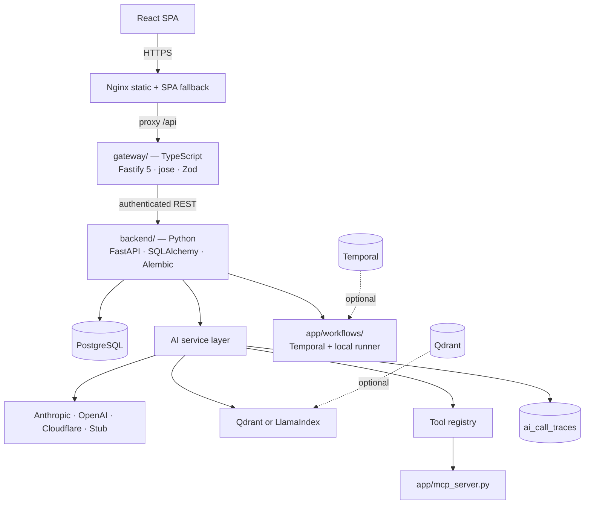

# Architecture

Four deployable pieces and a set of optional stateful services. This document
explains what each one owns, and why the boundaries are where they are.

## Services

### gateway/ — the caller-facing boundary

Owns JWT verification, CORS, body limits and the proxy allowlist. It exists so
unauthenticated traffic never reaches the AI service, and so the Python service
stays the single issuer of credentials — the gateway verifies tokens, it does
not mint them.

Two decisions worth knowing:

- **Public paths are method-aware.** `POST /api/tickets` is public so the contact
  form works before signup; `GET` of the same path is the authenticated ticket
  list. Matching on path alone was a real authentication bypass, now
  regression-tested.
- **502 is not remapped.** The backend answers 502 when an AI provider fails.
  That is not "the gateway is unavailable", so it is passed through rather than
  rewritten to 503. A transport failure *is* 503.

### backend/ — the AI service

Owns the domain, the AI layer and the durable workflow. The AI layer is layered
so each concern is replaceable and testable alone:

| Module | Responsibility |
|---|---|
| `services/ai_service.py` | Provider abstraction (Anthropic / OpenAI / Cloudflare / stub), usage capture, retry on transient failure |
| `services/guardrails.py` | Deterministic output checks: commitments, ungrounded facts, injection, internal detail |
| `services/tracing.py` | Durable per-call traces (`ai_call_traces`) |
| `services/telemetry.py` | OpenTelemetry GenAI spans, OTLP export |
| `services/pricing.py` | Versioned rate table; `None` for an unknown model rather than a guess |
| `services/vector_store.py` | Qdrant backend with a LlamaIndex fallback |
| `services/knowledge_base.py` | Document ingestion and retrieval |
| `services/retrieval_service.py` | Per-ticket embeddings and similarity; vectors record their producer |
| `services/tool_agent.py` | Bounded tool-calling loop |
| `services/graph_workflow.py` | LangGraph pipeline with checkpointed approval gate |
| `tools/` | Read-only tools behind a validated, audited allowlist |
| `workflows/` | Temporal definitions and an in-process runner sharing the same stages |
| `mcp_server.py` | The same tools, published over MCP |

### Two runtimes, one workflow definition

`workflows/definitions.py` holds the Temporal workflow. `workflows/local_runner.py`
executes the identical stage functions, in the same order, with the same retry
ceiling and the same approval rule.

`TEMPORAL_ENABLED=false` (the default) selects the local runner, so development
and the test suite need no Temporal cluster. Setting it true gives durability:
retries across restarts, and an approval gate that suspends without holding a
worker.

The local runner's limits are stated in its own docstring — no history, no
restart survival, no cross-process wait. That difference is the reason to run
Temporal in production, and it is not papered over.

## Data flow: one ticket through the AI layer

1. `POST /api/tickets` creates the ticket with `category=UNKNOWN`,
   `priority=NORMAL`. No AI has run yet.
2. An agent triggers `POST /api/tickets/{id}/ai/analyze`. The provider call is
   wrapped in `tracing.trace_call(...)`, so a trace row exists whether the call
   succeeds, fails, or trips a guardrail.
3. Output is parsed into `AnalysisResult`. A parse failure raises before anything
   is persisted — the ticket is untouched.
4. Only after validation are the triage fields and an `ai_predictions` row
   written.
5. Retrieval uses Qdrant when configured and reachable, and LlamaIndex
   otherwise. A Qdrant failure degrades retrieval; it does not fail the request.

## State

| Store | Required | Purpose |
|---|---|---|
| PostgreSQL | Yes | Domain data, `ai_predictions`, `ai_call_traces`, ticket embeddings |
| Qdrant | No | Knowledge-base vector index; falls back to in-process LlamaIndex |
| Temporal | No | Durable workflow execution; falls back to the in-process runner |
| Redis | **No** | Not used. Rate limiting is in-process and therefore per-instance — see the gap noted in `docs/JD-MAP.md` |

## Data flow: the approval gate

The one place where durability actually matters. A refund-category ticket or a
draft mentioning a high-impact action must not proceed on the model's authority.

- **LangGraph path** (`POST /api/tickets/{id}/ai/workflow`): the graph suspends at
  `interrupt()`. State is checkpointed, no worker is held. `resume_ticket()`
  continues it with `Command(resume=...)`.
- **Workflow path** (`POST .../ai/workflow/run`): `wait_condition` blocks on a
  flag set by the `approve` / `reject` signal.
- **Local runner**: the run parks with `requires_approval`; `decide()` resolves it.

All three apply the same predicate, `needs_approval()`, so a local run and a
Temporal run cannot disagree about what needs a human.