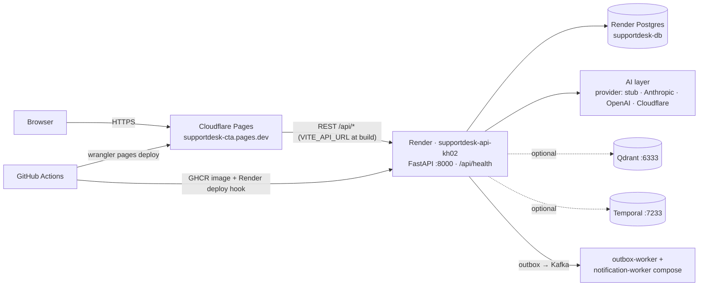
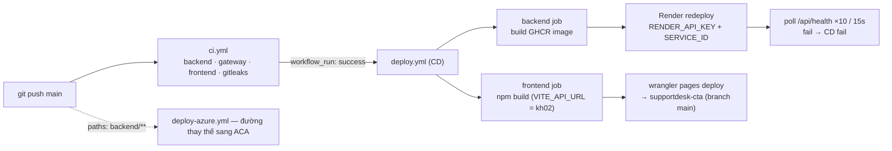
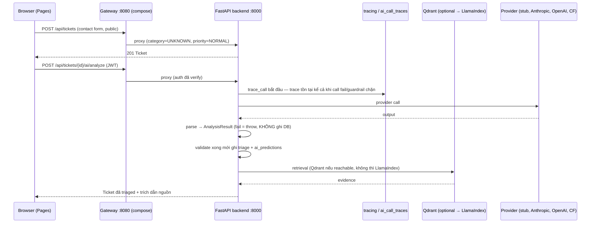
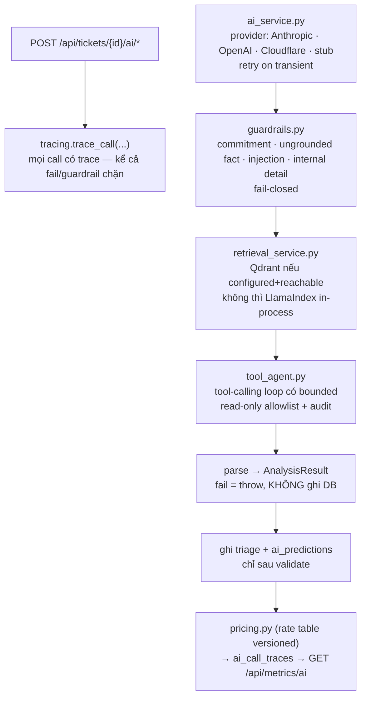
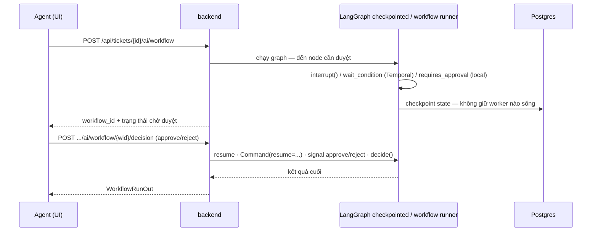

# Architecture — SupportDesk

> Bản đồ kiến trúc SupportDesk: **service map → hạ tầng cloud (verified) → DevOps → luồng API → luồng AI**.
> Boundary chi tiết từng service nằm ở cuối tài liệu. Trạng thái production (URL sống/suspended):
> `README.md` → *Production status*; deploy: `docs/deploy-checklist.md`, `deploy/README.md`.

## 1. Service map (code thật)

| Service | Tech | Port | Vai trò | Chạy ở đâu |
|---|---|---|---|---|
| `frontend` | React 18 + nginx serve `dist/` | 80 | SPA | **Prod: Cloudflare Pages** `https://supportdesk-cta.pages.dev`; legacy `supportdesk-aht.pages.dev` đã loại khỏi CORS — **không demo** |
| `gateway` | TypeScript · Fastify 5 · jose · Zod | **8080** (compose `127.0.0.1:8080`) | verify JWT, CORS, body limit, proxy allowlist `/api` → backend | compose; **Prod hiện tại: Pages gọi thẳng backend** (bundle build với `VITE_API_URL`) |
| `backend` | Python 3.11 · FastAPI · SQLAlchemy · Alembic | **8000** | domain, AI layer, workflow, auth issuer | local compose `127.0.0.1:8000`; **Prod: Render** `https://supportdesk-api-kh02.onrender.com` (Docker, health `/api/health`) |
| `db` | PostgreSQL 16 | 5432 | domain + `ai_predictions` + `ai_call_traces` + ticket embeddings | Render Postgres `supportdesk-db` (blueprint) / compose |
| `kafka` (KRaft) | apache/kafka 3.7 | 9092 | outbox/SLA event stream | compose (hạ tầng local — Render blueprint không gồm Kafka) |
| `outbox-worker` + `notification-worker` | Python (cùng image backend) | — | publish outbox → Kafka → notification consumer | compose; `START_BACKGROUND_WORKERS=true` trên Render |
| `qdrant` | Qdrant | 6333 | knowledge-base vectors — **optional**, fallback LlamaIndex in-process | compose / cloud |
| `temporal` | temporalio/auto-setup | 7233 | durable workflow — **optional**, `TEMPORAL_ENABLED=false` (mặc định) → local runner | compose |

Canonical production (README audited 2026-10-07, post-CD):

- Frontend: `https://supportdesk-cta.pages.dev` (bundle gọi `supportdesk-api-kh02.onrender.com`).
- API: `https://supportdesk-api-kh02.onrender.com` — `/api/health` 200, `/openapi.json` 200,
  unauth `/api/tickets` 401, CORS preflight từ Pages origin → 200.
- `supportdesk-api-zpkv.onrender.com` **SUSPENDED** — không bao giờ tham chiếu; `aht` legacy — không demo.
- `render.yaml`: `CORS_ORIGINS=https://supportdesk-cta.pages.dev`, `AI_PROVIDER=stub`,
  `AI_EMBED_PROVIDER=bow`, `ALEMBIC_MIGRATE=true`, `JWT_SECRET=generateValue`, health `/api/health`.
  **Owner action:** sync blueprint lên service `kh02` rồi chạy `scripts/smoke-production.sh`.

## 2. Hạ tầng cloud (verified) — đường request thật

**Ranh giới:** CORS bị ghim đúng origin Pages canonical; `JWT_SECRET` do Render sinh (không trong repo);
`CLOUDFLARE_API_TOKEN` / `RENDER_API_KEY` / `RENDER_SERVICE_ID` chỉ là GitHub secrets.

## 3. DevOps / CI-CD (workflow thật trong `.github/workflows/`)

| Workflow | Trigger | Jobs | Gate / kết quả |
|---|---|---|---|
| `ci.yml` | push, PR, dispatch | `backend` · `gateway` · `frontend` · `gitleaks` | pytest (backend), vitest (gateway), frontend build; secret scan |
| `deploy.yml` (CD) | `workflow_run` **CI success @main** hoặc dispatch | `backend` → `frontend` | backend: build image `ghcr.io/imtarget05/supportdesk:{sha,latest}` → **Render redeploy** (`RENDER_API_KEY`/`RENDER_SERVICE_ID`) → poll `/api/health` ×10 lần/15s (**fail = CD fail**); frontend: `npm run build` với `VITE_API_URL` mặc định `https://supportdesk-api-kh02.onrender.com` → `wrangler pages deploy` (project `vars.CLOUDFLARE_PAGES_PROJECT`, fallback `supportdesk`, branch `main`) |
| `deploy-azure.yml` | push `main/master` paths `backend/**`, dispatch | `test-and-deploy` | pytest subset (`test_main`, `test_tickets`, `test_outbox_kafka_sla`) → `deploy/scripts/deploy-azure.sh`; thiếu `AZURE_CREDENTIALS` → **fail trung thực** (không báo xanh giả) |
| `render-readiness.yml` | `workflow_call` | `poll` | reusable readiness poll dùng bởi CD |

**Repo variables/secrets cần có:** `RENDER_API_KEY`, `RENDER_SERVICE_ID`, `CLOUDFLARE_API_TOKEN`,
`CLOUDFLARE_ACCOUNT_ID`, `VITE_API_URL` (optional override), `CLOUDFLARE_PAGES_PROJECT` (= `supportdesk-cta`).

## 4. Luồng API end-to-end

### Endpoint map (backend FastAPI, luôn qua prefix `/api`)

| Nhóm | Method + Path | Ghi chú |
|---|---|---|
| Auth | `POST /api/auth/register` · `POST /api/auth/login` · `POST /api/auth/bootstrap` · `GET /api/auth/me` | Python là **issuer duy nhất** (gateway chỉ verify) |
| Tickets | `POST /api/tickets` · `GET /api/tickets` · `GET/PATCH /api/tickets/{id}` · `POST /api/tickets/{id}/assign` · `POST /api/tickets/{id}/transition` · `GET /api/tickets/{id}/audit` | `POST /api/tickets` **public** (contact form trước đăng ký); `GET` cùng path là danh sách đã auth |
| AI | `POST /api/tickets/{id}/ai/analyze` · `/ai/suggest` · `/ai/agent` · `/ai/workflow` · `/ai/workflow/run` · `POST .../ai/workflow/{wid}/decision` · `GET .../ai/workflow/{wid}` · `GET /api/tickets/{id}/similar` | `analyze` = provider call có trace; `workflow` = LangGraph interrupt; `workflow/run` = runner + `wait_condition` |
| Knowledge | `POST /api/ai/knowledge/ingest` · `GET /api/ai/knowledge/stats` | Qdrant khi cấu hình, fallback LlamaIndex |
| Metrics | `GET /api/metrics` · `GET /api/metrics/ai` · `GET /api/metrics/ai/recent` · `GET /api/dashboard/stats` | p50/p95 theo model, lỗi rate, cost/ticket |
| SLA/automation | `GET /api/sla/metrics` · `POST /api/sla/evaluate` · `GET /api/sla/outbox/stats` · `POST /api/sla/outbox/publish-now` · `POST /api/automation/jobs` | outbox → Kafka (compose) |
| Webhook | `POST /api/webhooks/inbound-email` | mail inbound → ticket |

Gateway (khi chạy qua compose): public method-aware — `POST /api/tickets`, `POST /api/auth/login`,
`POST /api/auth/register`; còn lại cần JWT; path `/healthz`, `/readyz` trả lời tại chỗ.

### Sequence: một ticket đi qua lớp AI

## 5. Luồng AI (layer AI của backend)

Mỗi provider call đi qua ống khung này — thay provider không đổi luồng:

- **Guardrails fail-closed:** output vi phạm → chặn, không "sửa nhẹ rồi cho qua".
- **Không có tool ghi side-effect** ngoài allowlist; MCP (`app/mcp_server.py`) publish đúng bộ tool đó.
- **Eval là gate CI:** `evaluation/eval_suite.py --check` so `evaluation/baseline.json` —
  accuracy rơi >2pp, guardrail-rate tăng, hoặc p95 latency nổ → **CI fail**.

### Approval gate — chỗ duy nhất cần durability thật

Ticket refund / draft nhắc hành động high-impact **không được đi tiếp bằng quyền của model**:

Ba runtime dùng chung **một predicate** `needs_approval()` nên local run và Temporal run không bao giờ
khác nhau về việc "cái gì cần người". Temporal path vẫn là **EXPERIMENTAL** (chưa chạy trên cluster
thật) — ghi nhận như vậy, không nói durability là đã chứng minh.

## 6. Service boundaries (giữ nguyên ranh giới đã thiết kế)

### `gateway/` — ranh giới tiếp nhận request
Sở hữu JWT verification, CORS, body limit, proxy allowlist. Tồn tại để traffic chưa auth **không bao giờ**
đến được AI service, và Python service vẫn là **issuer duy nhất** (gateway verify, không mint token).

- **Public path method-aware:** `POST /api/tickets` public (contact form), `GET` cùng path là danh sách
  đã auth. Matching theo path từng là lỗ hổng auth bypass — giờ có regression test.
- **502 không bị remap:** backend trả 502 khi AI provider fail — đó không phải "gateway chết", pass
  through; transport failure thật sự mới là 503.

### `backend/` — AI service

| Module | Trách nhiệm |
|---|---|
| `services/ai_service.py` | provider abstraction, usage capture, retry transient |
| `services/guardrails.py` | deterministic output checks (fail-closed) |
| `services/tracing.py` | trace bền trong `ai_call_traces` |
| `services/telemetry.py` | OpenTelemetry GenAI spans, OTLP export |
| `services/pricing.py` | rate table versioned — model lạ trả `None`, không đoán giá |
| `services/vector_store.py` | Qdrant backend, fallback LlamaIndex |
| `services/knowledge_base.py` · `retrieval_service.py` | ingestion + retrieval theo ticket, vector ghi rõ producer |
| `services/tool_agent.py` | tool-calling loop bounded |
| `services/graph_workflow.py` | LangGraph pipeline + checkpointed approval gate |
| `tools/` | read-only, validated + audited allowlist |
| `workflows/` | Temporal definitions + local runner cùng stage functions |
| `mcp_server.py` | cùng bộ tool, publish qua MCP |

### Hai runtime, một workflow definition
`workflows/definitions.py` giữ Temporal workflow; `workflows/local_runner.py` chạy **cùng stage functions,
cùng thứ tự, cùng retry ceiling, cùng approval rule**. `TEMPORAL_ENABLED=false` (mặc định) chọn local
runner — đó là đường test suite chạy. Giới hạn local runner được ghi trong docstring chính nó
(không có history, không sống restart, không chờ cross-process) — không chỗ nào được che.

## 7. State

| Store | Required | Purpose |
|---|---|---|
| PostgreSQL | **Yes** | domain data, `ai_predictions`, `ai_call_traces`, ticket embeddings |
| Qdrant | No | knowledge-base vector index → fallback LlamaIndex in-process |
| Temporal | No | durable workflow → fallback in-process runner |
| Redis | **Không dùng** | rate limit in-process (per-instance) — gap ghi tại `docs/JD-MAP.md` |
| Kafka (compose) | local | outbox/SLA event stream (blueprint Render không gồm) |

## 8. Tài liệu liên quan

- Trạng thái production: `README.md` → *Production status* · smoke: `scripts/smoke-production.sh`
- ADR: `docs/adr/` (Container Apps thay AKS, Service Bus thay Kafka, Azure AI Search vs Qdrant, Blob vs R2, Render preview)
- Nói đúng thứ chưa có: `docs/JD-MAP.md` (kể cả gap), `docs/interview-qa.md` (bằng chứng Temporal)
- Deploy checklist: `docs/deploy-checklist.md` · runbook: `deploy/README.md`

